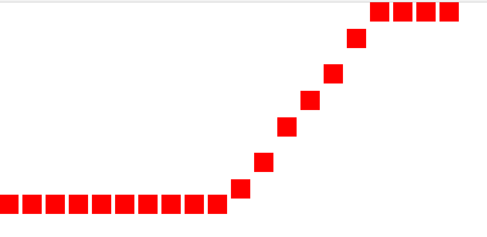

# JavaScriptBase Description
1.setting

2.mobile chat & picture switch

3.js生成100个li标签  & V动态自动生成 & 解决兼容的悬浮显示

4.QQlist &　带缩略图的图片切换 & 按钮控制多组图片切换

5.输入框限制格式输入

6.搜狐视频记录片列表展示 &　选择卡里套选择卡

7.百度文库评分 &　百度音乐-全选操作

8.延时消失的菜单 &　淘宝商品广告效果 &　自动轮换选项卡 &　按钮控制商品图片上下滚动

9.模拟下雨-点击空白处方块依次掉落 &　照片抖动效果 &　点击加分效果-可重复点击 &　图片自动切换 &　新浪数码频道选项卡

10.时间自动切换 &　倒计时抢购商品

